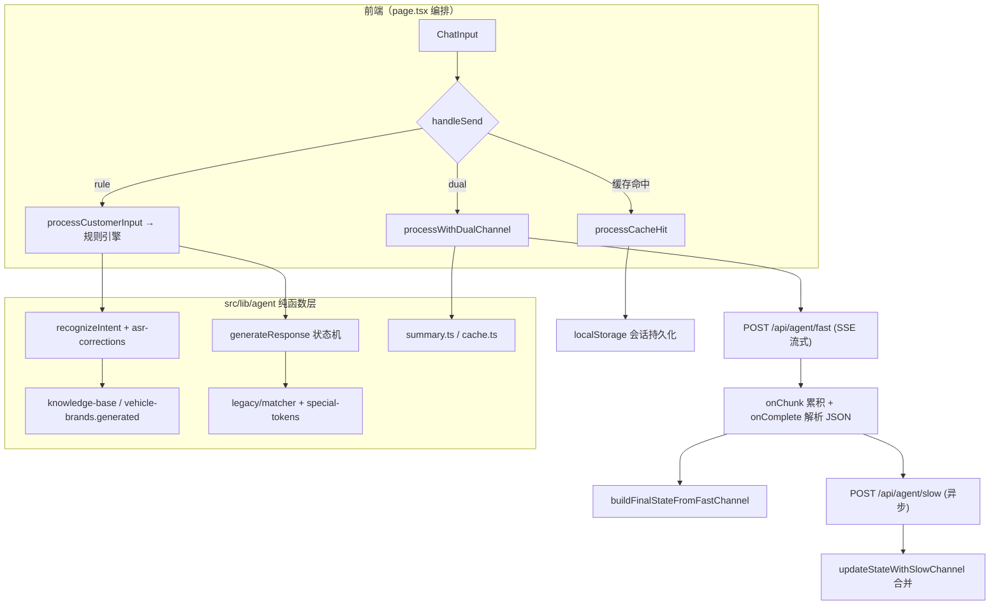

# csagentParadigm 架构分析报告

> 日期：2026-08-10
> 范围：完整代码走读 + 运行验证（139 例基线测试 → 修复后 149 例）+ 意图识别实测探针
> 结论：作为"范式验证/参考实现"，设计自洽、论证完整；存在 3 个高优先级确定性缺陷（已修复），以及一批生产化待办。

---

## 一、项目定位

这不是上线系统，而是面向老低代码平台侧的**参考实现/范式验证**：论证"补全局变量 + 改 prompt 模板"能解决老平台"幻觉 + 记不住"问题。核心论证链：

1. 老平台每轮 LLM 裸调用、无跨轮上下文变量（用 4 个流程数据包坐实）；
2. 本项目用"状态机 + 槽位档案 + 每轮上下文注入"证明解法可行；
3. 交付物 = 代码 + 文档 + 平台侧最小改动清单。

## 二、架构总览

层次清晰：纯函数引擎层（engine/state-machine/intent/cache/summary/knowledge-base）与无状态 API 层（fast/slow 路由）分离，前端 page.tsx 承担编排。

## 三、设计亮点

- **根因导向**：每轮 prompt 强制注入【状态】+【已收集清单】+【最近对话/摘要】，从机制上解决跨轮失忆。
- **防御纵深**：非法 next_state 回退、状态只进不退、姓氏齐了强制 FAREWELL、称谓清洗（王先生→王您好）、慢通道护栏复核。
- **双通道延迟架构**：快通道流式出话术、慢通道异步复盘，互不阻塞、各自降级。
- **竞态防护**：代次令牌 + ref 读取最新状态 + 慢通道结果合并缓存。
- **知识库安全契约**：跨品牌重名车系（53 组）宁可返回 null 也不错误归属。
- **工程纪律**：TS strict、139+ 例单测全绿、tsc 零错误、提交历史连贯、边界如实声明。

## 四、缺陷清单与处置

### 已修复（本次）

| # | 缺陷 | 影响 | 修复 |
|---|---|---|---|
| 1 | 否定意图漏判：`"我不是看蔚来"` 被识别为 `agree` 且品牌误入槽（根因：agreeWords 含单字"是"、disagreeWords 缺"不是"等） | 违反"否定防误收集"设计，客户拒绝却被记录意向 | 移除"是"；扩充否定词表；否定判断移到问候/超范围/肯定之前；"是不是"疑问句防护 |
| 2 | 超范围判断先于否定：`"不考虑分期"` → `out_of_scope`，拒绝被当提问 | 推销流程无视客户拒绝 | 否定优先于超范围 |
| 3 | 缓存词表与意图词表双份矛盾：`"不需要"` 在 dual 模式命中 `ANY:dislike` 直接退出，rule 模式却是否定挽留；"骚扰/烦死了"两处归类相反 | 同输入三模式行为不一致，演示易翻车 | cache.ts 改为复用 intent.ts 词表（单一事实来源）；反感/辱骂顺序对齐 |
| 4 | 时间识别缺口：`"明年买"/"今年买"` → `off_track` | 6 个采集字段之一识别不了，影响信息完整率 | timePatterns 增加 明年/后年/今年 |
| 5 | 规则状态机 `ask_vehicle` 无品牌分支回复为空字符串 | 客户问"有什么车"得到空消息 | 补引导话术 |
| 6 | 流式期间把原始 JSON 逐字渲染给用户；JSON 截断时把半截 JSON 当回复 | 体验硬伤，且 TTS 无法直接消费 | 服务端增量提取 response 字段（`response-stream.ts`），chunk 事件只下发话术文本；疑似 JSON 但解析失败/空回复 → 明确降级 |
| 7 | 快通道 prompt 未覆盖"否定→柔性挽留"，LLM 可能把"不需要"当反感退出 | 模式间行为漂移 | prompt 增加否定挽留规则与 disagree/wait intent 参考 |
| 8 | 慢通道"车身类型"实体键无映射、token 估算正则少了尾部码位 | 回填丢失/估算偏差 | 补 `车身类型→vehicleType` 映射；`\u9fa3` → `\u9fa5` |

### 待办（未修，按优先级）

| 优先级 | 事项 | 说明 |
|---|---|---|
| 高 | 编排逻辑不可测试 | 双通道合并/竞态/降级全在 page.tsx（约 300 行），建议抽成 `useAgent` hook（reducer 模式），page.tsx 只做渲染 |
| 高 | API 无鉴权/限流/输入校验 | 任何能访问服务的人都能烧 token；建议 zod 校验 + 鉴权头 + 限流 |
| 高 | 日志含 PII | 每请求 console.log 全量 prompt+消息（dev.log 已存客户姓氏/尾号/城市）；建议脱敏/分级 logger（`.env`、`*.log` 已被 gitignore，未入库） |
| 中 | 客户端 abort 不取消服务端 LLM 调用 | "停止生成"只断读循环，服务端可能继续生成计费；建议路由内监听 request signal 级联取消 |
| 中 | 慢通道结果重复 apply | onResult 与 onComplete 会对同一结果应用两次（当前靠幂等掩盖），建议改为增量合并 |
| 中 | rolling summary 语义单薄 | 只摘要已收集字段，不含"已回答话题/护栏事件"，长对话仍可能重复解释；建议补语义摘要 |
| 中 | 知识库重名车系（53 组） | prompt 注入时建议对歧义车系标注"请先确认品牌"，避免 LLM 猜归属 |
| 中 | 会话持久化仅 localStorage | 单 key、无上限、易超配额静默失败；项目已装 supabase/pg/drizzle 但未用，建议服务端会话存储 |
| 低 | 文档漂移 | README/AGENTS.md 测试数（本次已同步为 149）；现有成果汇报的 infoComplete 口径（surname+phoneTail）与实际代码（仅 surname）不一致，建议下次汇报时修正 |
| 低 | 死代码/残留 | `processCustomerInput` 的 llm/dual 分支是死代码；"LLM"模式按钮实际降级到规则引擎；chat 路由与 prompt-builder 无人使用；`src/lib/agent/1.txt`、`.vs/` 应清理 |

## 五、修复验证

- 单测：139 → **159 例全部通过**（新增 20 例覆盖否定/超范围优先级/时间/缓存一致性/空回复/流式提取器）。
- 类型检查：`tsc -p tsconfig.json --noEmit` 零错误。
- ESLint：改动文件 0 error（3 个既有 warning 未动）。

关键回归用例（探针实测修复前行为）：

| 输入 | 修复前 | 修复后 |
|---|---|---|
| 我不是看蔚来 | `agree` + 品牌入槽 | `disagree`，品牌不收集 |
| 不考虑分期 | `out_of_scope` | `disagree` |
| 明年买 | `off_track` | `confirm_time`（timing=明年） |
| 不需要（dual 缓存路径） | ANY:dislike 退出 | 不命中缓存，交 LLM/规则挽留 |

## 六、流式优化（面向 TTS/ASR 交付）

双通道的快通道是语音侧延迟的关键路径，本次对 SSE 协议做了面向交付的优化：

1. **chunk 事件即话术**：服务端用 `src/lib/agent/response-stream.ts` 对 LLM 流做增量 JSON 解析，只提取 `response` 字段实时下发。TTS/ASR 接入方不需要理解 JSON 结构，直接消费 chunk 文本即可播报。
2. **first_token 口径对齐**：首字延迟改为"话术首个文本到达"（而非 LLM 首个 token），与"客户说完到开始播报"的体感一致，可作验收指标。
3. **原始 JSON 不丢**：`done` 事件仍携带 `fullContent`（完整 JSON），用于状态机构建与调试面板展示。
4. **容错**：LLM 未按 JSON 模板输出时，纯文本内容补发一次；JSON 截断/空回复走降级，不把半截 JSON 播给客户。
5. **可测试**：提取器为纯函数状态机，10 例单测覆盖逐字符切分、关键词跨块、转义符、unicode 跨块等边界。

> 注：若后续接 TTS，可直接把 `chunk` 事件文本送入合成队列，无需再解析 JSON。
